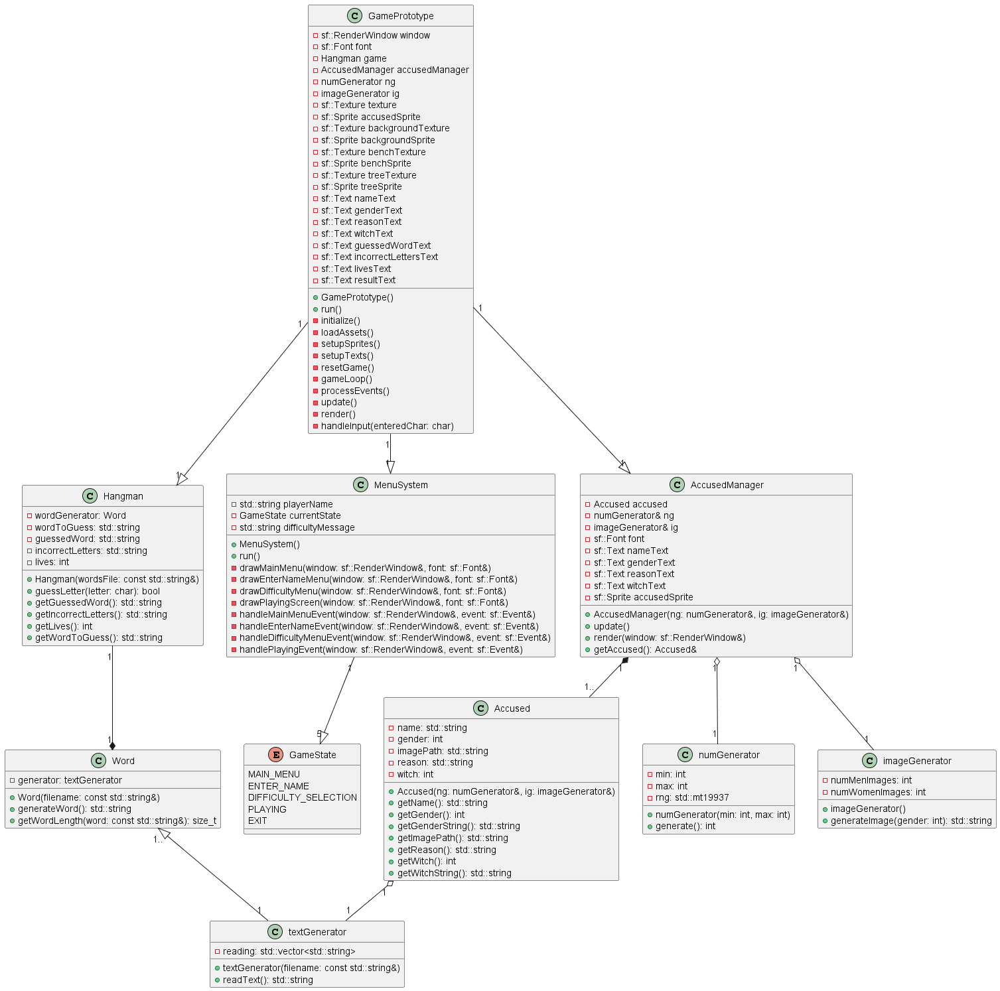

# Hangman The Game

## Objective
The objective of this project is to develop an interactive hangman game using the C++ programming language and the SFML (Simple and Fast Multimedia Library) graphic library. This project is designed to provide a fun experience. Through the development of this game, it is expected to improve C++ skills and gain experience in using SFML for creating graphical interfaces and event handling.

## Specific Goals
Hangman Game Implementation:
Create the logic for the hangman game, including word selection, tracking guessed letters, and detecting win or lose conditions.

Graphical Interface with SFML:
Develop an attractive graphical interface using SFML, displaying the hidden word, guessed letters, and the current state of the hangman.
Include graphical elements such as backgrounds, buttons, and animations to enhance the user experience.

Event Handling:
Implement user event handling such as inputting letters via the keyboard and interacting with the graphical interface.

### Development
The development of the code has been meticulously structured to ensure clarity and ease of understanding, both for initiating new developers and comprehending the overall idea of the project. Special emphasis has been placed on organizing files intuitively, allowing developers to quickly dive into the code and grasp the project's structure.

The project is organized to facilitate understanding and development, it has a makefile configured to allow separate tests for the Game and Word libraries, streamlining the debugging process and guaranteeing code quality at each stage of development. A special command, make run, has been added to quickly run the game animation, making it easier to view and test the project.

#### Libraries for Data Management
To manage data efficiently, special libraries have been created. These libraries encapsulate the core logic of the game and provide a clear interface for interaction. The primary libraries include:
- Generator.hpp 
This library generates an important part of the code's operation, it has text, image and number generators and the three are output randomly so that the game is not very repetitive.
- Words.hpp
What this library does is give us random text from the Generate library to be able to play.
- Accused.hpp
This bookstore is responsible for giving us a defendant who we have to save or not from hanging
- AccusedManager.hpp
This library works as a manager of our Accused class, this to have better control and management over them
- Menu_System.hpp
This library works as a state machine to manage the different screens that were structured for the game

#### Design Patterns 
In this case we use design patterns such as the Factory for the creation of the defendants, a manager to control the use of these defendants, a Composite type pattern and we manage everything through a state machine which works as a menu to show and change each of the game scenes

### Folders
- bin/ - Contains the project executables
- src/ - Contains the source code
- include/ - The header files
- assets/ - Contains the project resources
- docs/ - Contains the project documentation

# Description
The hangman game is an exciting and challenging experience that entertainingly simulates the trials and punishments of the Middle Ages. In this game, the player must guess a hidden word before the drawing of a hanged figure is completed, representing the tragic fate of those who failed to defend themselves adequately in times past.

The game offers three levels of difficulty to tailor the experience to the player's skill level:
- Easy: The words are common and relatively short.
- Medium: The words are of medium length and less commonly used.
- Hard: The words are long and rare, presenting a true challenge for those with an extensive vocabulary and deductive skills.

The game is hand-drawn, with an aesthetic that evokes the times of the Middle Ages. Every element, from the letters to the hangman figure itself, has been illustrated in detail to immerse the player in the historical atmosphere. The hand-drawn art not only adds a unique and personal touch to the game but also enhances the overall immersion and player experience.
Immerse yourself in this historical experience and test your wits and vocabulary in a hangman game that combines the thrill of the challenge with art and history. Can you save the character from their tragic fate by guessing the word in time? Find out as you play!

# Dependencias
This project has the following dependencies:

- **SFML** - Graphics and multimedia library for C++. Version 2.5.1 or higher.
- **CMake** - Cross-platform tool for generating build scripts. Version 3.15.0 or higher.

## Plugins VSCode
- *material icon*
- *plant uml*
- **c/c++**
- *indent-rainbow*
- **Path Intellisense**

## Graphviz
`sudo apt update`
`sudo apt install graphviz`